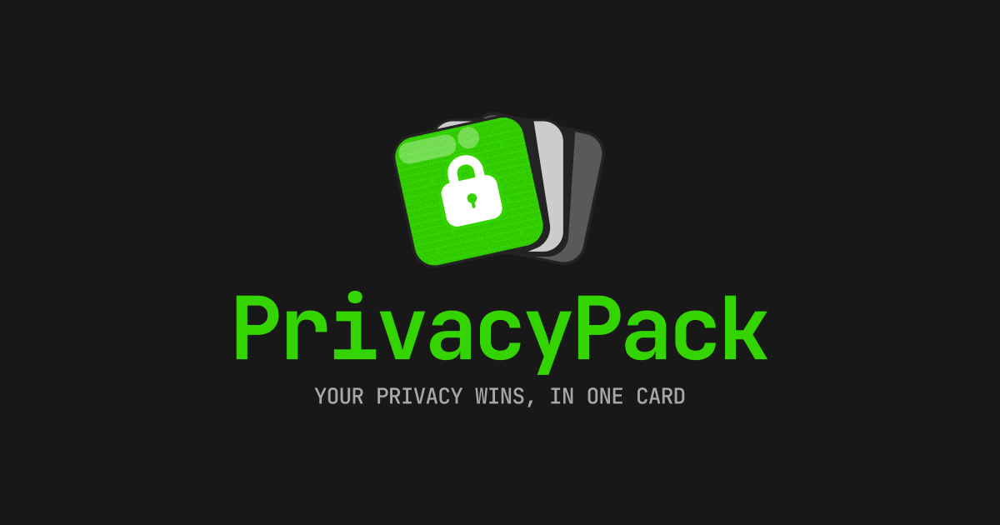

# PrivacyPack.org

Pick the mainstream apps you used before, show the privacy-respecting tools you’ve switched to, and share your privacy wins!

Create your pack at [PrivacyPack.org](https://privacypack.org).



## Development Setup

### Prerequisites

- Node.js (v18 or higher)
- npm

### Local Development

1. Clone the repository

```bash
git clone https://github.com/ente-io/privacypack.git
cd privacypack
```

2. Install dependencies

```bash
npm install
```

3. Start the development server

```bash
npm run dev
```

The application will be available at `http://localhost:3000`

## Add a missing app

New apps can be added to the catalog by modifying `/data/apps.json` and opening a PR. Each app belongs to a category and is either a mainstream app or a privacy-focused alternative.

### App logo requirements

When adding a new app, please ensure the logo meets these specifications:

- Format: JPG
- General: 200x200px, no rounded corners, no transparent background, sufficient padding around the logo
- File size: < 50KB
- Location: Place the logo file in `/public/app-logos/{app_id}.jpg`

## About

PrivacyPack is created and maintained by [Ente](https://ente.io), the makers of Ente Photos and Ente Auth.

## License

PrivacyPack is distributed under the [MIT license](/LICENSE).
